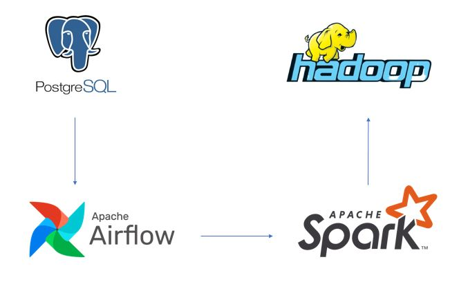
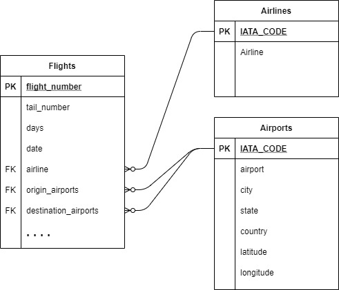

# End-to-end ETL Data Flight Delays and Cancellations

Project ini menggunakan beberapa referensi `image` atau `container` berikut:

* `postgres`: Postgres database menyimpan metadata Airflow & sebagai OLTP database.
    * Image: postgres:13.2
    * Database Port: 5432
    * References: https://hub.docker.com/_/postgres

* `airflow-webserver`: Airflow webserver and Scheduler ETL jobs.
    * Image: Dockerfile
    * Port: 8080
    * References: https://github.com/puckel/docker-airflow 

* `spark`: Spark Master.
    * Image: docker.io/bitnami/spark:3
    * Port: 8181
    * References: 
        * https://hub.docker.com/r/bitnami/spark 
        * https://github.com/bitnami/bitnami-docker-spark

* `spark-worker-N`: Spark Workers. Anda bisa menambahkan spark-worker di docker-compose file.
    * Image: docker.io/bitnami/spark:3
    * References: 
        * https://hub.docker.com/r/bitnami/spark 
        * https://github.com/bitnami/bitnami-docker-spark

* `hadoop`: Hadoop sebagai Data Lake & Data Warehouse.
    * Image: 
        * `docker-compose.yml`: teivah/hadoop:2.9.2
        * `docker-compose.yaml`: bde2020/hadoop
    * Port: 50070
    * References: 
        * https://hub.docker.com/r/teivah/hadoop
        * https://github.com/big-data-europe/docker-hadoop

### How to run
- Build with `docker-compose -f docker-compose.yaml build`
- Run with `docker-compose -f docker-compose.yaml up -d`
- Destroy with `docker-compose -f docker-compose.yaml down`

### Data Modelling Datawarehouse
- Extract, Transform, Load Pipeline
   
   

- Datawarehouse
   
   
